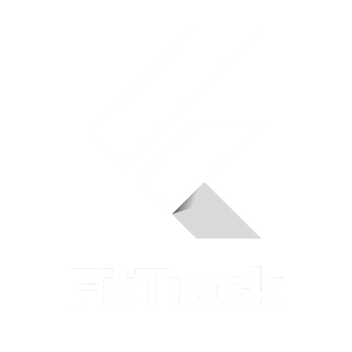

<p align="center">
  
</p>

# FitTrack - Personal Fitness Companion

A complete full-stack fitness tracking application built with Django REST Framework and React. Track your workouts, create custom workout plans, and monitor your fitness progress with beautiful charts and statistics.

## ✍️ Author

**Rabie Haddar** - [rabie.haddar1@gmail.com](mailto:rabie.haddar1@gmail.com)

---

## Features

### 🔐 Authentication
- User registration and login with JWT tokens
- Secure token refresh mechanism
- Protected routes for authenticated users

### 💪 Workout Management
- Create, edit, and delete custom workout plans
- Add exercises with sets, reps, and weight tracking
- Comprehensive exercise library

### 📊 Workout Logging
- Log completed workouts based on your plans
- Track actual performance vs. planned workouts
- Add notes and observations for each exercise

### 📈 Progress Tracking
- Interactive dashboard with workout statistics
- Visual charts showing workout frequency and types
- Progress tracking over time
- Weekly, monthly, and overall statistics

### 🎨 Modern UI/UX
- Responsive design with Bootstrap 5
- Clean, professional interface
- Smooth animations and transitions
- Mobile-friendly experience

## Tech Stack

### Backend
- **Django 5.0** - Web framework
- **Django REST Framework** - API framework
- **Django REST Framework SimpleJWT** - JWT authentication
- **SQLite** - Database (easily configurable for PostgreSQL)
- **Django CORS Headers** - CORS handling

### Frontend
- **React 18** - Frontend framework
- **TypeScript** - Type safety
- **React Router** - Navigation
- **Axios** - HTTP client
- **Bootstrap 5** - UI framework
- **Chart.js** - Data visualization
- **Lucide React** - Icons

## Installation & Setup

### Backend Setup

1. **Create a virtual environment**:
```bash
cd backend
python -m venv venv
source venv/bin/activate  # On Windows: venv\Scripts\activate
```

2. **Install dependencies**:
```bash
pip install -r requirements.txt
```

3. **Configure settings**:
```bash
# Update backend/fittrack/settings.py
# Change SECRET_KEY for production
# Update database settings if needed
```

4. **Run migrations**:
```bash
python manage.py makemigrations
python manage.py migrate
```

5. **Create a superuser**:
```bash
python manage.py createsuperuser
```

6. **Start the development server**:
```bash
python manage.py runserver
```

The Django backend will be available at `http://localhost:8000`

### Frontend Setup

1. **Install dependencies**:
```bash
npm install
```

2. **Start the development server**:
```bash
npm run dev
```

The React frontend will be available at `http://localhost:5173`

## API Endpoints

### Authentication
- `POST /api/auth/register/` - User registration
- `POST /api/auth/token/` - Login (get JWT tokens)
- `POST /api/auth/token/refresh/` - Refresh JWT token
- `GET /api/auth/user/` - Get current user info

### Workout Plans
- `GET /api/workout-plans/` - List user's workout plans
- `POST /api/workout-plans/` - Create new workout plan
- `GET /api/workout-plans/{id}/` - Get specific workout plan
- `PUT /api/workout-plans/{id}/` - Update workout plan
- `DELETE /api/workout-plans/{id}/` - Delete workout plan

### Workout Logs
- `GET /api/workout-logs/` - List user's workout logs
- `POST /api/workout-logs/` - Create new workout log
- `GET /api/workout-logs/{id}/` - Get specific workout log
- `PUT /api/workout-logs/{id}/` - Update workout log
- `DELETE /api/workout-logs/{id}/` - Delete workout log

### Statistics
- `GET /api/stats/` - Get workout statistics

## Project Structure

```
FitTrack/
├── backend/
│ ├── accounts/
│ ├── workouts/
│ ├── fittrack/
│ ├── db.sqlite3
│ ├── manage.py
│ └── requirements.txt

├── src/
│ ├── assets/
│ │ └── images/
│ ├── auth/
│ ├── components/
│ ├── contexts/
│ ├── dashboard/
│ ├── workouts/
│ ├── App.tsx
│ ├── main.tsx
│ ├── index.css
│ └── vite.config.ts

├── package.json
├── tsconfig.json
└── README.md
```

## Usage

1. **Register/Login**: Create an account or log in with existing credentials
2. **Create Workout Plans**: Design custom workout routines with exercises, sets, and reps
3. **Log Workouts**: Record your completed workouts with actual performance data
4. **Track Progress**: View your fitness journey through the dashboard and history

## Development

### Running Tests
```bash
# Backend tests
cd backend
python manage.py test

# Frontend tests (if added)
npm test
```

### Building for Production
```bash
# Frontend build
npm run build

# Backend deployment
# Configure production settings
# Set up proper database (PostgreSQL recommended)
# Configure static files serving
```

## Contributing

1. Fork the repository
2. Create a feature branch (`git checkout -b feature/amazing-feature`)
3. Commit your changes (`git commit -m 'Add amazing feature'`)
4. Push to the branch (`git push origin feature/amazing-feature`)
5. Open a Pull Request

## Support

For support and questions, please open an issue on GitHub or contact the development team.

---

**FitTrack** - Transform your fitness journey with intelligent workout tracking! 💪
